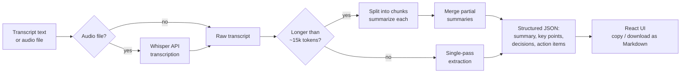

# AI Meeting Summarizer

Turn a messy meeting transcript (or an audio recording) into structured, shareable minutes: an executive summary, key discussion points, decisions made, and action items with owners.

**Live demo:** _add your deployed URL here after following [Deployment](#deployment)_
**Repo:** _add your GitHub URL here after following [Push to GitHub](#push-to-github)_

---

## Table of contents

- [Features](#features)
- [How it works](#how-it-works)
- [Tech stack](#tech-stack)
- [Project structure](#project-structure)
- [Local setup](#local-setup)
- [API reference](#api-reference)
- [Deployment](#deployment)
- [Push to GitHub](#push-to-github)
- [Design notes & tradeoffs](#design-notes--tradeoffs)
- [Possible extensions](#possible-extensions)

---

## Features

| Deliverable | Where it lives |
|---|---|
| **Transcript processor** | Accepts pasted text or a `.txt` upload; accepts audio (`.mp3`, `.wav`, `.m4a`, `.webm`, etc.) and transcribes it with Whisper first |
| **Key point extractor** | `backend/summarizer.py` → `key_points[]` in the response |
| **Action item identifier** | `backend/summarizer.py` → `action_items[]`, each with `task`, `owner`, and optional `due_date` |
| **Summary generator** | `executive_summary`, `decisions[]`, and `participants[]`, plus one-click copy/download as Markdown so it's ready to send to the room |

Long transcripts are handled automatically: text over ~15k tokens is split into chunks, summarized independently, then merged into one coherent result, so processing speed stays predictable regardless of meeting length.

## How it works



The extraction step uses OpenAI's JSON mode with a strict schema in the system prompt, so the model always returns parseable, predictable fields instead of free-form prose.

## Tech stack

- **Backend:** Python, FastAPI, OpenAI API (`gpt-4o-mini` for extraction, `whisper-1` for audio)
- **Frontend:** React (Vite), plain CSS (no framework lock-in)
- **Deployment:** single Render web service (FastAPI serves the built React app directly)

## Project structure

```
ai-meeting-summarizer/
├── backend/
│   ├── main.py            # FastAPI app: routes + serves the built frontend
│   ├── summarizer.py      # prompting, chunking, OpenAI calls
│   ├── requirements.txt
│   └── .env.example
├── frontend/
│   ├── src/
│   │   ├── App.jsx
│   │   ├── api.js         # fetch wrappers for the backend
│   │   ├── sampleData.js  # one-click demo transcript
│   │   └── components/
│   │       ├── TranscriptPanel.jsx
│   │       └── SummaryResults.jsx
│   └── package.json
├── render.yaml             # one-file Render deployment blueprint
└── README.md
```

## Local setup

You'll need Python 3.11+, Node 18+, and an [OpenAI API key](https://platform.openai.com/api-keys).

**1. Backend**

```bash
cd backend
python3 -m venv venv && source venv/bin/activate   # Windows: venv\Scripts\activate
pip install -r requirements.txt
cp .env.example .env        # then paste your OPENAI_API_KEY into .env
uvicorn main:app --reload --port 8000
```

**2. Frontend** (in a second terminal)

```bash
cd frontend
npm install
npm run dev
```

Open the URL Vite prints (typically `http://localhost:5173`). It's pre-configured to proxy `/api` calls to the backend on port 8000, so no extra setup is needed. Click **"Try a sample"** to test the whole flow instantly without needing your own transcript.

## API reference

### `POST /api/summarize`

```json
// Request
{ "transcript": "Alice: ...\nBob: ...", "meeting_title": "Q3 Planning" }

// Response
{
  "title": "Q3 Product Roadmap Sync",
  "executive_summary": "...",
  "key_points": ["...", "..."],
  "decisions": ["..."],
  "action_items": [
    { "task": "Ship mobile redesign mocks", "owner": "Marta Ruiz", "due_date": "Wednesday" }
  ],
  "participants": ["Priya Nair", "Daniel Cho", "Marta Ruiz", "Sam Okafor"]
}
```

### `POST /api/transcribe`

Multipart form upload with a `file` field (audio, ≤25MB). Returns `{ "transcript": "..." }`.

### `GET /api/health`

Returns `{ "status": "ok" }`. Useful for uptime checks and confirming a deploy is live.

## Deployment

The whole app deploys as **one** Render web service: FastAPI serves both the API and the built React app, so there's a single URL and a single set of environment variables.

1. Push this repo to GitHub (see [next section](#push-to-github)) if you haven't already.
2. Go to [dashboard.render.com](https://dashboard.render.com) → **New +** → **Blueprint**, and point it at your repo. Render will read `render.yaml` automatically and configure the service for you.
   - No `render.yaml`-based blueprint? Create a **Web Service** manually instead, with:
     - Build command: `cd frontend && npm install && npm run build && cd ../backend && mkdir -p static && cp -r ../frontend/dist/* static/ && pip install -r requirements.txt`
     - Start command: `cd backend && uvicorn main:app --host 0.0.0.0 --port $PORT`
3. Add your `OPENAI_API_KEY` as an environment variable when prompted (Render calls this out because `render.yaml` marks it `sync: false`, i.e. secret).
4. Deploy. The first build takes a few minutes; Render gives you a live `https://<your-service>.onrender.com` URL when it's done.

**Good to know:** Render's free tier spins a service down after 15 minutes of no traffic, so the first request after idle time takes 30-60 seconds to wake back up. That's normal — refresh once and it'll be fast from then on. Upgrading to a paid instance removes this.

## Push to GitHub

```bash
cd ai-meeting-summarizer
git init
git add .
git commit -m "Initial commit: AI meeting summarizer"
git branch -M main
git remote add origin https://github.com/<your-username>/<your-repo-name>.git
git push -u origin main
```

(Create an empty repo first at [github.com/new](https://github.com/new) — don't initialize it with a README, or the push above will conflict with it.)

## Design notes & tradeoffs

- **Single service over two:** FastAPI serving the React build keeps deployment to one step and one URL, which matters more for a time-boxed build than the marginal benefit of splitting frontend/backend.
- **JSON mode over function calling:** simpler to reason about and portable across OpenAI models; a stricter alternative would be the `json_schema` structured output mode on newer models.
- **Map-reduce chunking:** keeps long transcripts from silently failing or getting truncated, at the cost of an extra API call for very long meetings.
- **`gpt-4o-mini` default:** chosen for latency and cost; swap `SUMMARY_MODEL` in `.env` for a larger model if accuracy matters more than speed for your use case.

## Possible extensions

- Speaker diarization for audio with multiple overlapping voices
- Slack/email integration to auto-send the summary to participants
- A history view backed by a database (currently stateless — each request is independent)
- Confidence flags on action items where the owner was ambiguous in the transcript
